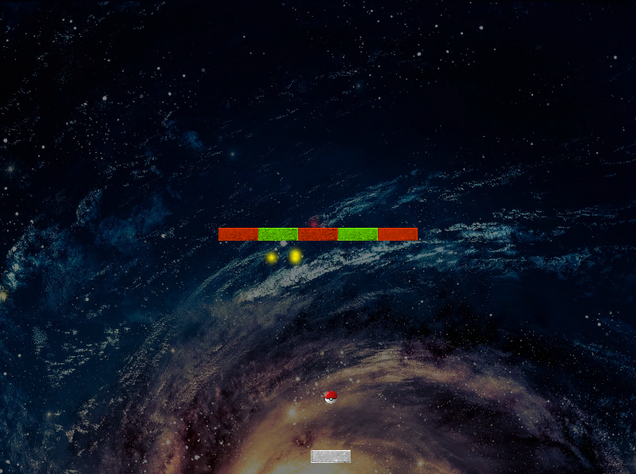

# BlockBreaker
**Block Breaker** - это классическая аркадная игра, в которой игрок должен управлять платформой, пиная мяч, который разбивает блоки на уровне. Цель игры - разрушить все блоки на уровне, не давая мячу упасть за нижнюю границу экрана.

## **Особенности**
**Управление платформой:** Игрок может двигать платформу влево и вправо для отбивания шарика.  
**Физика отскока шарика:** Шарик отскакивает от стенок и блоков, изменяя свое направление движения.  
**Разнообразные блоки:** На уровнях размещены различные типы блоков, имеющие разную прочность. Некоторые блоки могут быть разрушены с нескольких ударов, а некоторые блоки могут иметь специальные свойства.  
**Уровни сложности:** Игра предлагает несколько уровней сложности, где количество блоков, их расположение и поведение шарика могут меняться.  
**Звуковые и визуальные эффекты:** Игра сопровождается звуковыми и визуальными эффектами, которые создают атмосферу аркадной игры.  
_* в игре имеется режим __Автоматическая игра__, который включается в префабе __Padding___

### **Среда разработки:** Unity

## **Установка и запуск**
1) Клонируйте репозиторий на свой локальный компьютер.
2) Откройте проект в выбранной среде разработки.
3) Запустите игру

